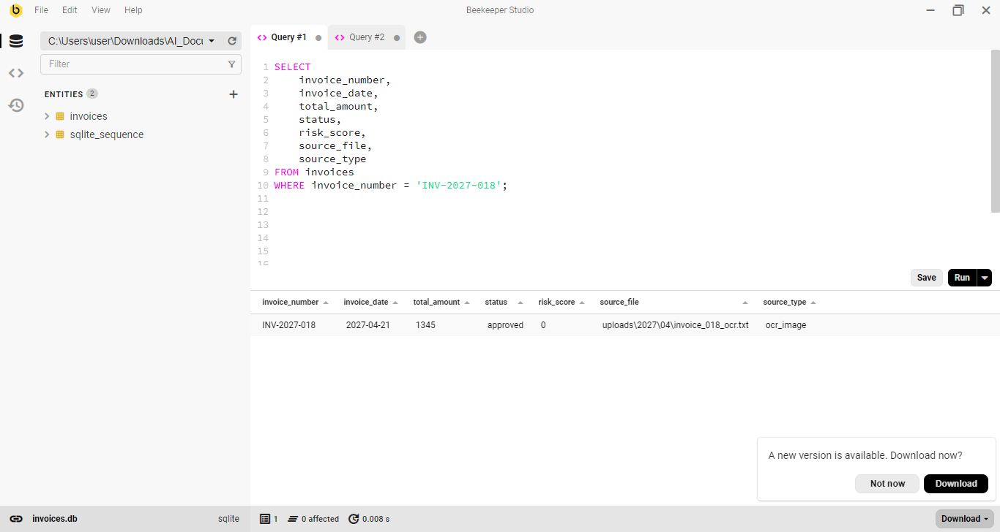
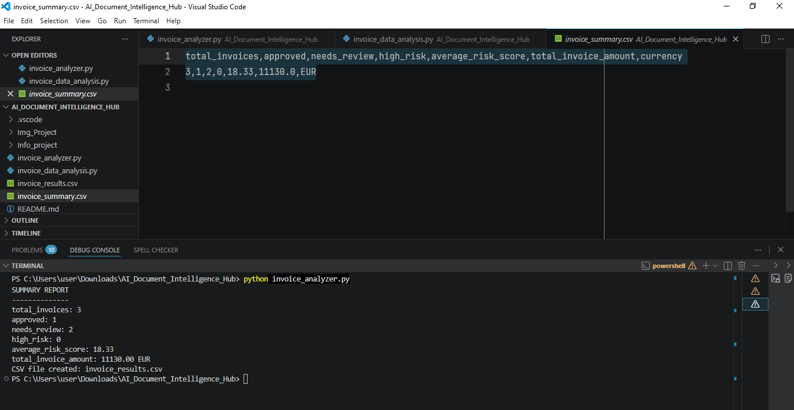
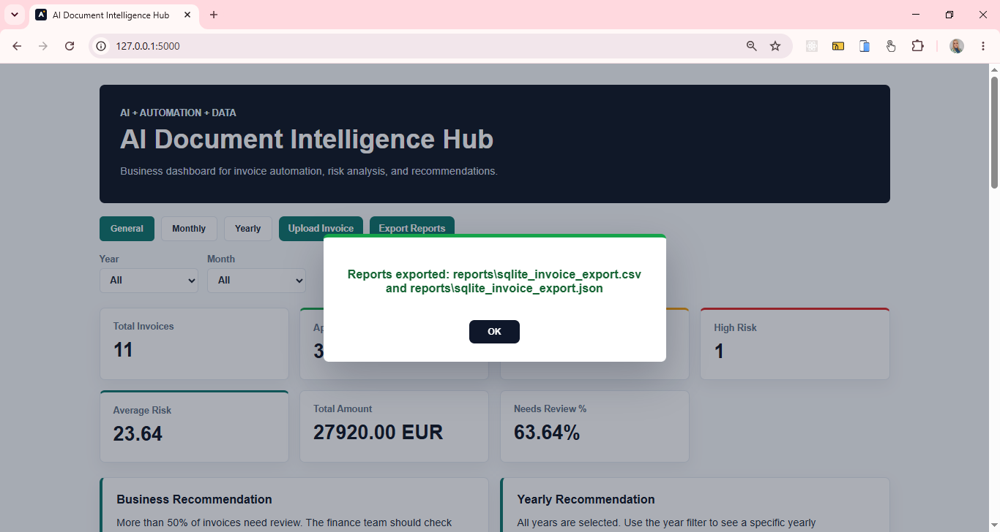
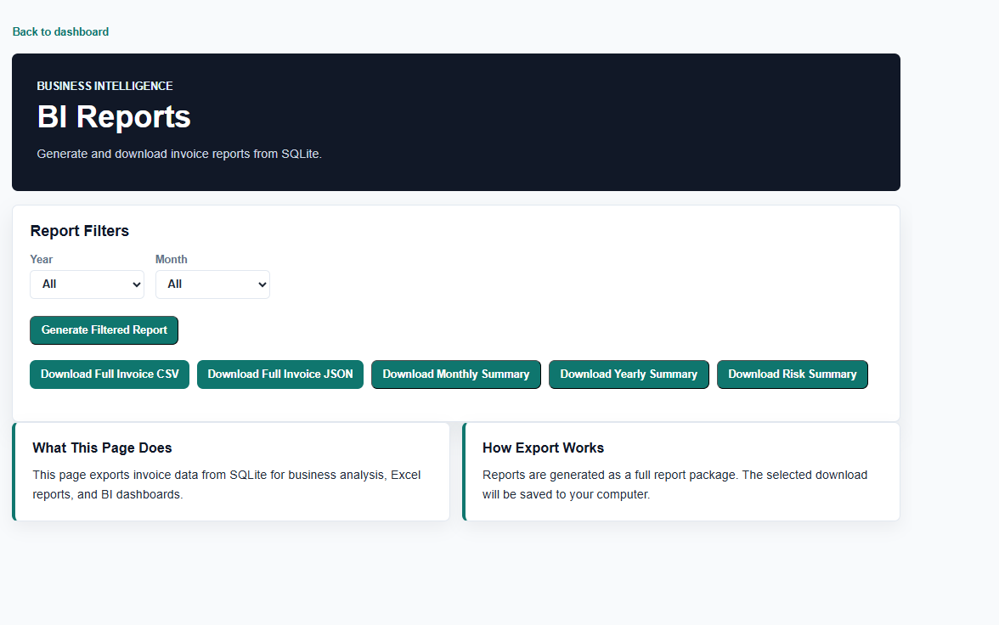
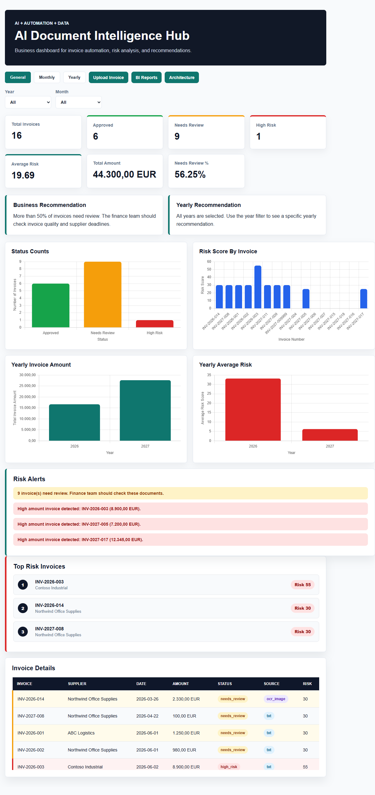
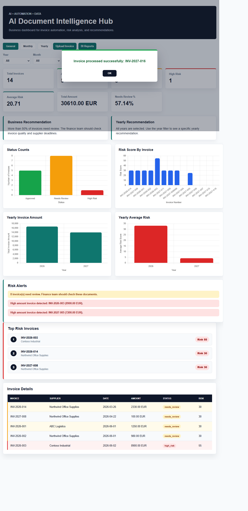
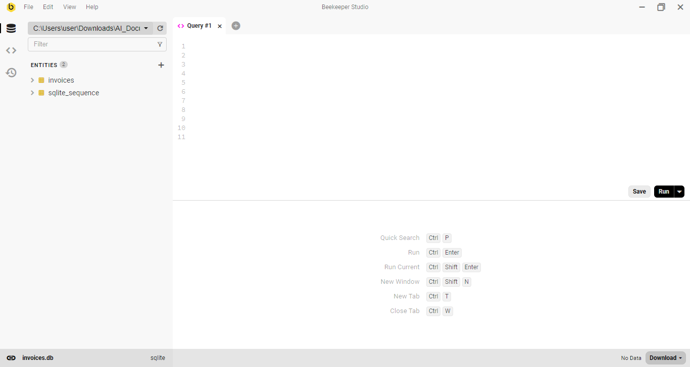
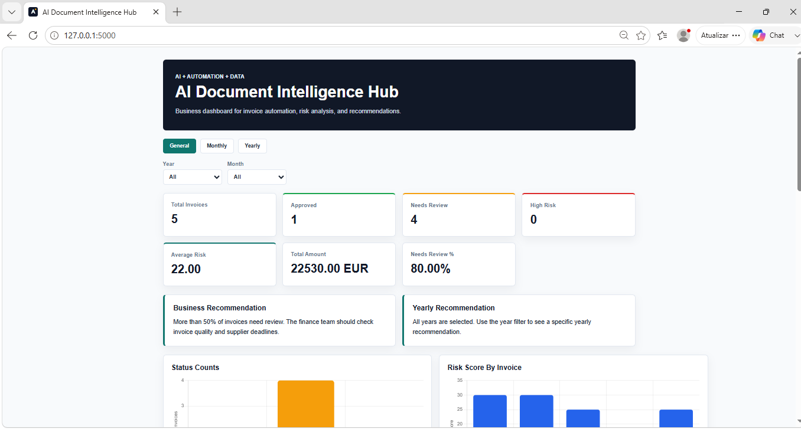

# AI_Document_Intelligence_Hub
Built an AI-powered document automation system using Python, Flask, OCR, Pandas, SQL and Machine Learning to classify business documents, detect missing fields, identify risks and generate dashboard reports.

# AI Document Intelligence Hub

Projeto de IA + automação + dados para processar documentos empresariais, começando por invoices.

Este projeto está sendo construído passo a passo para aprender como um sistema real pode evoluir de arquivos simples para uma aplicação web com banco de dados, dashboard, análise de risco e futuramente OCR e Machine Learning.

---

## Objetivo Do Projeto

Criar um sistema que lê documentos empresariais, extrai dados importantes, valida informações, calcula risco, salva os resultados e mostra tudo em um dashboard web.

Fluxo futuro completo:

```text
Document
↓
OCR reads document text
↓
Python extracts fields
↓
Python validates fields
↓
Python creates risk score
↓
Python saves results in CSV / database
↓
Pandas analyzes the saved data
↓
Flask shows dashboard and charts on a web page
```

---

## Fluxo Atual Do Projeto

Hoje o projeto já evoluiu para um fluxo mais profissional:

```text
Upload .txt
↓
Flask receives the file
↓
Python reads invoice text
↓
Python extracts invoice fields
↓
Python validates invoice data
↓
Python calculates risk score
↓
Python saves data into SQLite
↓
Flask API sends data to frontend
↓
Dashboard updates automatically
```

Em inglês A2:

```text
The user uploads an invoice.
Flask receives the file.
Python processes the invoice.
SQLite saves the data.
The dashboard shows the result.
```

---

## Fases Do Projeto

### Fase 1: Python + TXT

Começamos com invoices em formato `.txt`.

O objetivo era entender a lógica principal:

```text
Raw invoice text
↓
Extract fields
↓
Validate data
↓
Create risk score
↓
Show result
```

### Fase 2: CSV + Pandas

Depois salvamos os resultados em CSV.

O CSV ajudou no aprendizado de:

```text
Data export
Excel reports
Pandas analysis
Business metrics
```

Fluxo da fase:

```text
.txt invoices
↓
invoice_analyzer.py
↓
reports/invoice_results.csv
↓
invoice_data_analysis.py
↓
Pandas reports
```

### Fase 3: JSON + Dashboard

Depois criamos JSON para conectar os dados com o frontend.

O JSON ajudou a preparar o projeto para web/API:

```text
CSV / Pandas
↓
JSON files
↓
JavaScript reads data
↓
Dashboard shows metrics and charts
```

### Fase 4: Flask API

Depois criamos Flask para transformar o projeto em uma aplicação web real.

Fluxo:

```text
Flask backend
↓
API route
↓
Frontend dashboard
```

Rotas importantes:

```text
/              -> dashboard
/api/invoices  -> invoice data as JSON
/invoice/<id>  -> invoice detail page
/upload        -> upload invoice page
```

### Fase 5: SQLite

Depois adicionamos SQLite como banco de dados.

Agora o dashboard não depende mais diretamente dos CSVs.

Fluxo atual:

```text
SQLite database
↓
Flask API
↓
JavaScript frontend
↓
Dashboard
```

Em inglês A2:

```text
SQLite is the main database.
The dashboard reads data from SQLite.
CSV files are now reports.
```

### Fase 6: Upload Pelo Sistema Web

Agora começamos a fazer upload de invoices pela própria aplicação.

Fluxo:

```text
Upload .txt
↓
Flask saves file
↓
Python processes invoice
↓
SQLite stores invoice
↓
Dashboard updates
```

---

## Estrutura De Pastas

```text
AI_Document_Intelligence_Hub/
├── app.py
├── data/
│   └── invoices.db
├── frontend/
│   ├── index.html
│   ├── invoice_detail.html
│   ├── upload.html
│   ├── styles.css
│   ├── app.js
│   └── favicon.svg
├── reports/
│   ├── invoice_results.csv
│   ├── invoice_results.json
│   ├── invoice_summary.csv
│   ├── invoice_summary.json
│   ├── business_recommendations.json
│   ├── invoice_monthly_summary.csv
│   └── invoice_monthly_status_summary.csv
├── sample_documents/
├── services/
└── uploads/
```

---

## Papel De Cada Pasta

### `sample_documents/`

Pasta usada no começo do projeto para guardar invoices de exemplo.

```text
sample_documents = old learning/test files
```

### `uploads/`

Pasta usada pelo sistema web.

Quando o usuário faz upload de uma invoice, o arquivo deve ser salvo aqui.

```text
uploads = files sent by the web app
```

No futuro, ela pode ficar organizada assim:

```text
uploads/
└── 2027/
    └── 02/
        └── invoice_006.txt
```

### `reports/`

Pasta de relatórios e exportações.

Guarda arquivos CSV, JSON e imagens de gráficos.

```text
reports = exported reports
```

### `data/`

Pasta do banco SQLite.

```text
data/invoices.db = main database
```

---

## CSV, JSON, SQLite E Dashboard

### CSV

CSV foi usado para aprender exportação, Pandas e relatórios.

Hoje o CSV continua útil para:

```text
Excel reports
Pandas analysis
BI exports
Simple backup
Business documentation
```

Mas o CSV não é mais a fonte principal do dashboard.

### JSON

JSON foi usado para conectar dados com frontend.

Hoje o JSON ainda pode ser útil para:

```text
APIs
Frontend data
Reports
External systems
```

### SQLite

SQLite é agora a fonte principal dos dados do dashboard.

```text
SQLite = system memory
CSV = exported report
JSON = web/API format
Dashboard = visual interface
```

### Dashboard

O dashboard lê os dados pela API Flask.

```text
SQLite
↓
Flask API
↓
JavaScript
↓
Dashboard
```

---

## Arquivos Python Principais

### `app.py`

Controla a aplicação Flask.

Responsabilidades:

```text
show dashboard
show upload page
receive uploaded invoice
return API data
show invoice detail page
```

Em inglês A2:

```text
app.py controls the web app.
It receives browser requests.
It sends pages and data.
```

### `invoice_analyzer.py`

Foi o primeiro controlador do projeto.

Responsabilidades:

```text
read .txt invoices
extract fields
validate invoices
create CSV report
```

Hoje ele continua importante para aprendizado e testes, mas o fluxo profissional está indo para Flask + SQLite.

### `invoice_data_analysis.py`

Analisa dados com Pandas e gera relatórios.

Responsabilidades:

```text
read invoice results
calculate metrics
create monthly summary
create yearly summary
create recommendations
create charts
export reports
```

### `services/database.py`

Cria conexão com SQLite e cria a tabela `invoices`.

```text
database.py manages the database structure.
```

### `services/database_importer.py`

Importa dados antigos de JSON/CSV para SQLite.

Foi importante na transição:

```text
old reports
↓
SQLite database
```

### `services/invoice_repository.py`

Busca dados no SQLite para o Flask.

Responsabilidades:

```text
load all invoices
find one invoice by invoice number
```

### `services/invoice_processor.py`

Processa uma invoice enviada pelo upload.

Responsabilidades:

```text
receive invoice text
extract fields
validate invoice
save invoice into SQLite
```

### `services/extractor.py`

Extrai informações do texto da invoice.

Exemplos de campos:

```text
invoice_number
supplier_name
invoice_date
due_date
total_amount
currency
vat_number
```

### `services/validator.py`

Aplica regras de negócio e risco.

Responsabilidades:

```text
check missing fields
check overdue date
check high amount
calculate risk score
define status
```

---

## Regras De Risco

```text
Missing field -> +15 risk points for each missing field
High total amount above 5000 -> +25 risk points
Due date overdue -> +30 risk points

Risk 0 -> approved
Risk 1 to 49 -> needs_review
Risk 50 to 100 -> high_risk
```

Em inglês A2:

```text
Risk score shows invoice risk.
A low score is good.
A high score needs review.
```

---

## Status Da Invoice

```text
approved
needs_review
high_risk
```

Significado:

```text
approved -> invoice is OK
needs_review -> finance team should check it
high_risk -> invoice has serious risk
```

---

## Dashboard Atual

O dashboard mostra:

```text
Total Invoices
Approved
Needs Review
High Risk
Average Risk
Total Amount
Needs Review %
Business Recommendation
Yearly Recommendation
Status Counts chart
Risk Score by Invoice chart
Yearly Invoice Amount chart
Yearly Average Risk chart
Risk Alerts
Top Risk Invoices
Invoice Details table
```

Também existe uma página de detalhe:

```text
/invoice/<invoice_number>
```

Exemplo:

```text
/invoice/INV-2026-001
```

---

## Conceitos Aprendidos

```text
Python functions
Flask routes
HTML pages
CSS styling
JavaScript DOM
Chart.js charts
CSV files
JSON files
Pandas analysis
SQLite database
SQL queries
Upload forms
Business rules
Risk score
Dashboard metrics
Project structure
Services architecture
```

---

## Conceitos De Mercado

Este projeto toca áreas como:

```text
Data Analyst
Automation Developer
Junior Python Developer
Business Intelligence
AI/ML Future
RPA / Operations Automation
Backend with Flask
Data Automation
```

Frase para portfólio:

```text
Built an intelligent document automation system that processes invoices, detects missing fields and risks, stores results in SQLite, and provides a Flask dashboard with business metrics, charts, alerts, and invoice detail pages.
```

Versão A2:

```text
I built a document automation app.
The app reads invoices.
It extracts data.
It checks risks.
It saves data in SQLite.
It shows a business dashboard.
```

---

## Próximos Passos

```text
1. Improve upload validation
2. Save uploaded files by year and month
3. Show success/error messages after upload
4. Add export reports from SQLite
5. Add PDF/image upload
6. Add OCR
7. Add document classification with Machine Learning
8. Add authentication/login
9. Add Docker
10. Prepare GitHub README and portfolio explanation
```

---

## Ideia Importante

O projeto começou simples de propósito.

```text
Simple first.
Professional later.
```

Primeiro aprendemos a lógica com TXT e CSV.

Depois evoluímos para Flask, API, SQLite e dashboard.

Isso é parecido com o mundo real: projetos crescem por fases.

Em inglês A2:

```text
The project grows step by step.
Each step teaches one new concept.
The system is becoming more professional.
```


### img projects:

## Screenshots

Here are some images showing the layout of the application:

________________________________________

<h4 align="center">Img Project - SQLite - Beekper Studio 🥰 🚀</h4>

<div align="center">
    <table>
        <tr>
            <td style="width: 50%; text-align: center;">
                
                <p style="margin-top: 5px;">SQL_Beekeeper-Studio_The column saves the invoice source type</p>
            </td>
            <td style="width: 50%; text-align: center;">
                
                <p style="margin-top: 5px;">Beekeeper-testes</p>
            </td>
        </tr>
    </table>
</div>

  <br/>
  <br/>


________________________________________

<h4 align="center">Invoice_summary.csv 🥰 🚀</h4>

<div align="center">
    <table>
        <tr>
             <td style="width: 50%; text-align: center;">
                
                <p style="margin-top: 5px;">Invoice_summary</p>
            </td>
            <td style="width: 50%; text-align: center;">
                
                <p style="margin-top: 5px;">Invoice_analyzer_This check belongs to invoice_analyzer</p>
            </td>
        </tr>
    </table>
</div>

  <br/>
  <br/>


  ________________________________________

  
<h4 align="center">Page BI_export 🥰 🚀</h4>

<div align="center">
    <table>
        <tr>
            <td style="width: 50%; text-align: center;">
                
                <p style="margin-top: 5px;">BI_export</p>
            </td>
            <td style="width: 50%; text-align: center;">
                
                <p style="margin-top: 5px;">Front_BI_Dowl_127.0.0.1_5000_reports</p>
            </td>
        </tr>
    </table>
</div>

  <br/>
  <br/>


________________________________________

<h4 align="center">Front_Project 🥰 🚀</h4>

<div align="center">
    <table>
        <tr>
             <td style="width: 50%; text-align: center;">
                
                <p style="margin-top: 5px;">Front_Project_127.0.0.1_5000</p>
            </td>
            <td style="width: 50%; text-align: center;">
                
                <p style="margin-top: 5px;">Front_127.0.0.1_5000_msg_invoice_017</p>
            </td>
        </tr>
    </table>
</div>

  <br/>
  <br/>


  ________________________________________


<div align="center">
    <table>
        <tr>
            <td style="width: 50%; text-align: center;">
                
                <p style="margin-top: 5px;">SQLite_Project_Beekeeper</p>
            </td>
            <td style="width: 50%; text-align: center;">
                
                <p style="margin-top: 5px;">127.0.0.1_5000__favicon</p>
            </td>
        </tr>
    </table>
</div>

  <br/>
  <br/>


________________________________________


---------

#### 🤝 Contributing
If you would like to contribute to this project, feel free to open an issue or submit a pull request! 🚀
________________________________________
#### 📜 License
This project is licensed under the MIT License - see the LICENSE file for details.
👩💻 Developed with 💙 by [[LuDiemert](https://www.linkedin.com/in/lucianadiemert/)]

________________________________________
- #### My LinkedIn - [](https://www.linkedin.com/in/lucianadiemert/)

________________________________________
## 🌐 **Contact**


#### [**Luciana Diemert**](https://github.com/ludiemert)

🛠 Full-Stack Developer <br>
🖥️ Python | Computer Vision | AI Integrations <br>
📍 Cork - Irland 
☎ +353 87 243 8690

<a href="https://www.linkedin.com/in/lucianadiemert" target="_blank"></a>&nbsp;
<a href="mailto:lucianadiemert@gmail.com" target="_blank"></a>&nbsp;
<a href="#"></a>&nbsp;
<a href="https://www.github.com/ludiemert" target="_blank"></a>&nbsp;

<br clear="left"/>

---
Developed with ❤ by [ludiemert](https://github.com/ludiemert).
